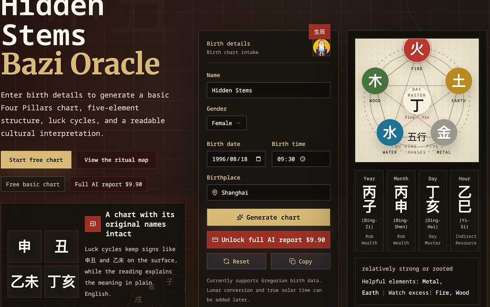
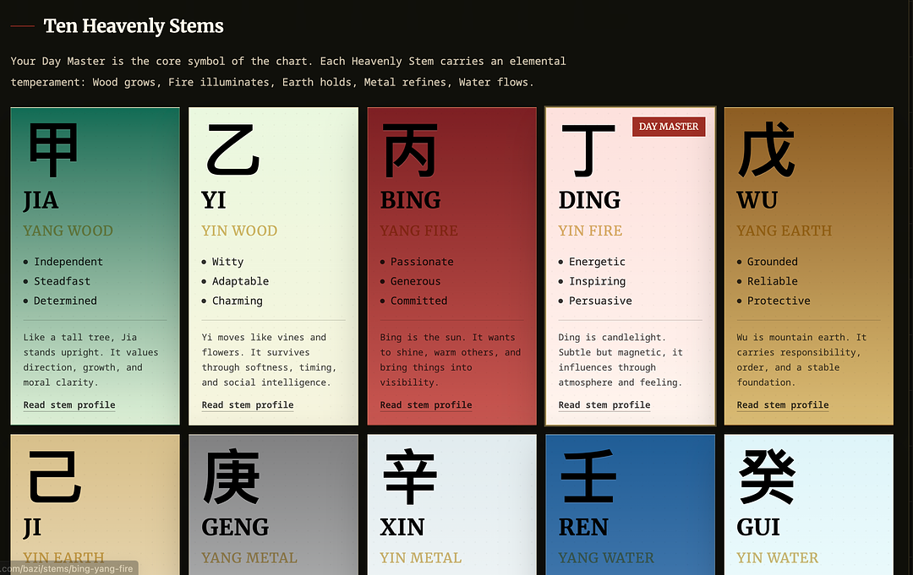

# Hidden Stems

[Hidden Stems](https://hiddenstems.com/bazi) is a Bazi / Four Pillars chart and reading tool.

It helps users generate a free Bazi chart, understand their Day Master, Five Elements, hidden stems, and luck cycles, and optionally unlock a deeper AI-assisted cultural reading.

## What It Does

- Generates a free Bazi / Four Pillars chart
- Shows the original Chinese Heavenly Stems and Earthly Branches
- Explains the Day Master and Five Elements in plain English
- Keeps traditional terms visible while making the chart easier for beginners
- Offers an optional paid report for a longer interpretation

## Ten Heavenly Stems

The Ten Heavenly Stems are presented like small oracle cards: Chinese characters first, English explanations second.

The goal is to preserve the texture of the original system while making it readable for people who are new to Bazi.

## Why It Exists

Many Bazi tools are difficult for beginners: they look like spreadsheets, assume the user already understands Chinese metaphysics, or turn the reading into generic advice.

Hidden Stems is designed to make the first chart experience easier without removing the cultural texture of the original system.

Try it here:

https://hiddenstems.com/bazi

## Languages

Hidden Stems supports English, Simplified Chinese, Traditional Chinese, Japanese, and Korean pages.

- English: https://hiddenstems.com/bazi
- Traditional Chinese: https://hiddenstems.com/zh-Hant/bazi
- Japanese: https://hiddenstems.com/ja/bazi
- Korean: https://hiddenstems.com/ko/bazi

## Disclaimer

Hidden Stems is for cultural learning, self-reflection, and entertainment. It is not medical, legal, financial, investment, or relationship advice.
